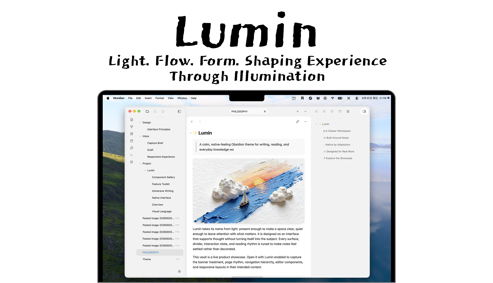
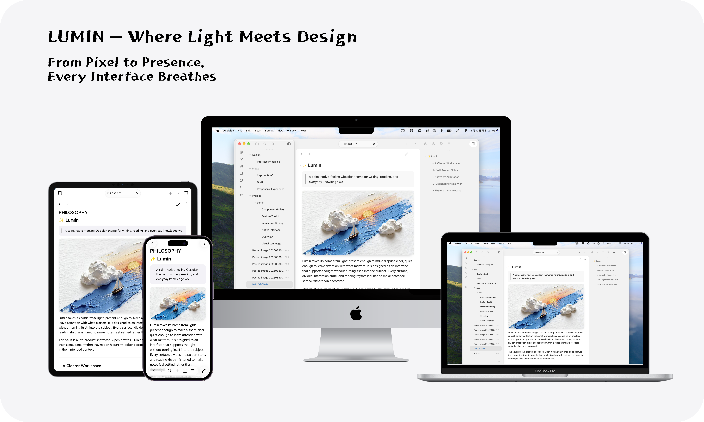
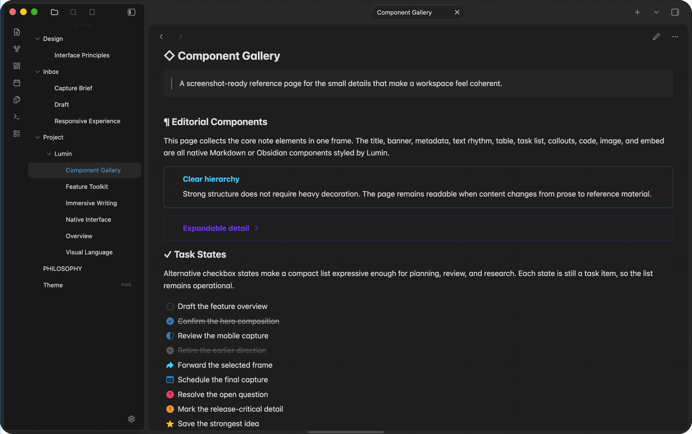
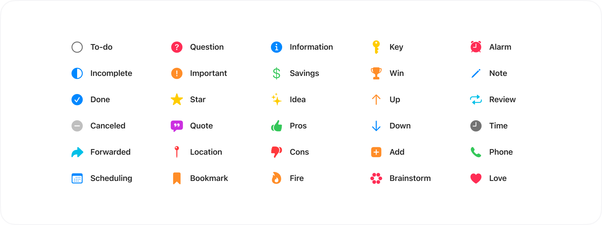

<h1 align="center">Lumin</h1>

<p align="center">A calm, native-feeling Obsidian theme for focused writing and everyday knowledge work.</p>

<p align="center">
  
  
  
</p>

<p align="center">
  <a href="https://community.obsidian.md/themes/lumin"></a>
  <a href="https://ko-fi.com/yixuanhq"></a>
</p>



Lumin keeps the note at the center of the workspace. Clear hierarchy, measured spacing, and familiar platform details make long writing sessions feel quieter without reducing the tools around your notes.

[简体中文说明](README_CN.md)

## At a glance

- **Platform-aware by default.** Lumin adapts its interface to macOS, Windows, Linux, Android, and mobile Obsidian, while still letting you turn off adaptive mode.
- **Built for reading and writing.** Refined typography, comfortable reading width, richer tables, callouts, embeds, banners, media, and image handling keep notes easy to scan.
- **A workspace that stays out of the way.** Use hoverable ribbons and sidebars, focus view, compact panel controls, and centered tabs to shape the desktop around your work.
- **Personal without patching CSS.** The optional Style Settings plugin exposes appearance, editor, and accessibility preferences directly in Obsidian.

## Every screen, one visual language

Lumin carries the same content-first hierarchy from desktop to tablet and phone, with light and dark appearance support throughout.



## Details that support the note

The theme styles the everyday building blocks of an Obsidian workspace: metadata, headings, task lists, callouts, code, tables, images, and embeds.



### Alternative checkboxes

Task states get a compact visual vocabulary while remaining standard Obsidian task items.



## Install

### From Obsidian

1. Open **Settings > Appearance > Themes**.
2. Select **Manage**, search for **Lumin**, then install and enable it.

### Manually

1. Download `manifest.json` and `theme.css` from the [latest release](https://github.com/yixuan-space/obsidian-lumin/releases).
2. Create `.obsidian/themes/Lumin/` in your vault.
3. Put both files in that directory.
4. In Obsidian, open **Settings > Appearance > Themes** and select **Lumin**.

## Customize

Install the [Style Settings](https://github.com/mgmeyers/obsidian-style-settings) community plugin to configure Lumin without custom CSS. Available controls include:

- Adaptive-mode and color preferences, including sidebar tint and Android dynamic color where supported.
- Desktop behavior such as hover ribbons, hover sidebars, focus view, tab alignment, compact panel controls, and media zoom.
- Editor preferences including reading width, block and media width, banner treatment, active-line highlight, link underlines, and image alignment.
- Accessibility options for motion, focus contrast, interface type size, and icon size.

## Development

Lumin requires Obsidian `1.11.6` or later and Node.js. Source styles live in `src/`; the root `theme.css` is the distributable theme file. Rebuild after SCSS changes:

```bash
npx --yes sass src/theme.scss theme.css --no-source-map
```

Commit the generated `theme.css` together with source changes.

## Credits

Lumin is based on [Cupertino](https://github.com/aaaaalexis/obsidian-cupertino). It includes MIT-licensed snippets from [Minimal](https://github.com/kepano/obsidian-minimal) and public-domain references from [Alternative Checkboxes Reference Set](https://github.com/damiankorcz/Alternative-Checkboxes-Reference-Set). See [third-party notices](THIRD_PARTY_NOTICES.md) for the applicable attribution and terms.

Craft and Material Design are visual references only; this repository does not redistribute their code or assets.

## License

YiXuan's original Lumin contributions are released under the [MIT License](LICENSE.txt). Included third-party material remains under its own terms in [THIRD_PARTY_NOTICES.md].
